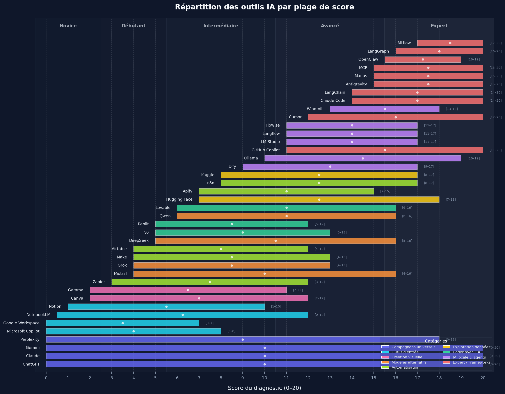

# Échelle de maturité en intelligence artificielle


## Structure

```txt
.
├── app/
│   ├── index.html                  # Page unique du diagnostic
│   └── assets/
│       ├── css/
│       │   ├── styles.css          # Styles principaux
│       │   └── pdf.css             # Styles dédiés à l'export PDF
│       ├── js/
│       │   └── app.js              # Logique Alpine.js (questionnaire, scoring, graphiques, export)
│       └── public/                 # Toutes les images du projet
│           ├── preview.webp        # Capture d'écran pour le README
│           ├── *.webp              # 40 logos d'outils IA (chatgpt, claude, gemini, etc.)
│           ├── tool_distribution_ranges.png   # Graphique des plages de score par outil
│           └── tool_distribution_density.png  # Graphique de densité d'outils par score
├── .gitignore
└── README.md
```

## Fonctionnalités principales

- Front statique en `HTML/CSS/JS` + `Alpine.js`, zéro dépendance back-end.
- Questionnaire **20 critères** (Q01–Q20) répartis en 5 dimensions :
  - Connaissances · Prise en main · Usages · Usages avancés · Usages experts
- Chaque critère à 3 états : _Non acquis_ (0 pt) · _Partiel_ (0,5 pt) · _Acquis_ (1 pt).
- Score global sur 20 avec **5 niveaux** : Novice → Débutant → Intermédiaire → Avancé → Expert.
- Restitution immédiate :
  - Niveau et profil personnalisé ;
  - Radar et trajectoire par dimension ;
  - **9 outils IA recommandés** parmi 40, sélectionnés par centralité sur le score obtenu ;
  - Points forts, axes de progression, recommandations contextualisées.
- Export direct en PDF côté navigateur (`Diagnostic-maturite-IA.pdf`).
- Aucune collecte de données personnelles.

## Répartition des outils IA par score

Les 40 outils du catalogue sont affectés chacun à une plage de score `[min, max]`. L'algorithme de recommandation sélectionne les 9 outils les plus pertinents pour le score obtenu.

### Plage de score de chaque outil



### Densité d'outils disponibles par score


## Lancer localement

```bash
cd app
python3 -m http.server 8080
```

Puis ouvrir `http://localhost:8080`.

## Intégration WordPress

1. Copier le contenu du `<main id="an-diagnostic">…</main>` depuis `app/index.html` dans un bloc HTML personnalisé.
2. Charger `assets/css/styles.css`, `assets/css/pdf.css`, `assets/js/app.js`, Alpine.js, `html2canvas` et `jsPDF` (CDN) sur la page.

## Feuille de route

- [ ] Intégrer le module de diagnostic sur le site WordPress.
- [ ] Générer un QR Code de partage avec suivi pour les conférences et les cours.
