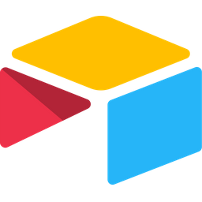
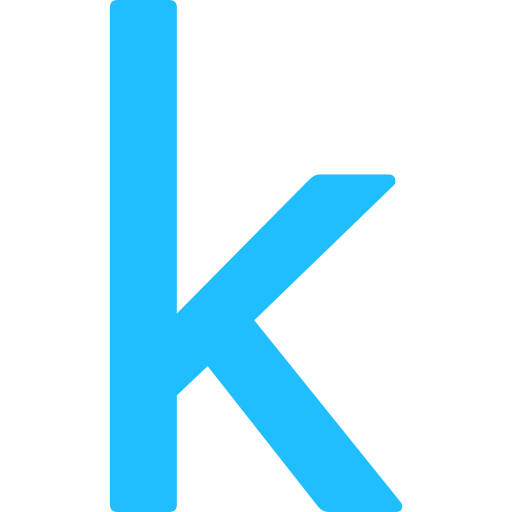
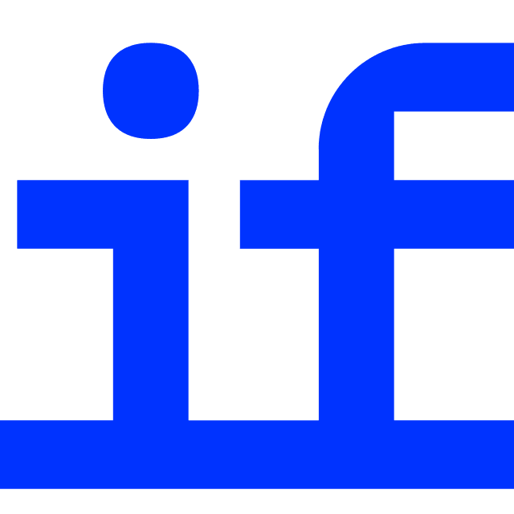
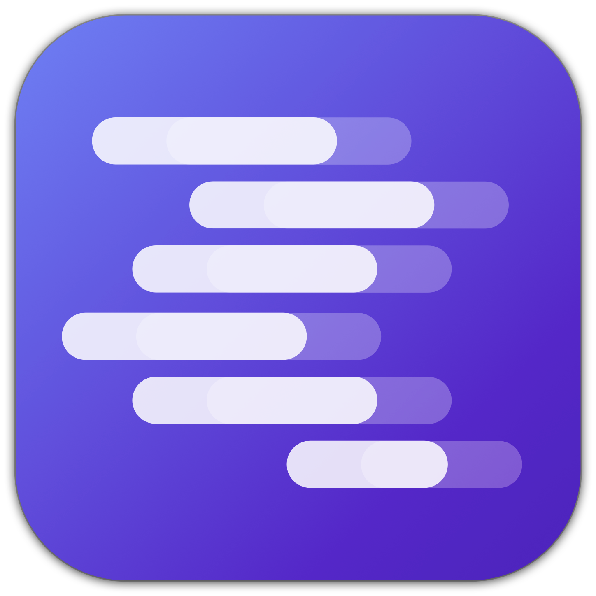
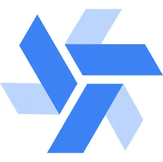
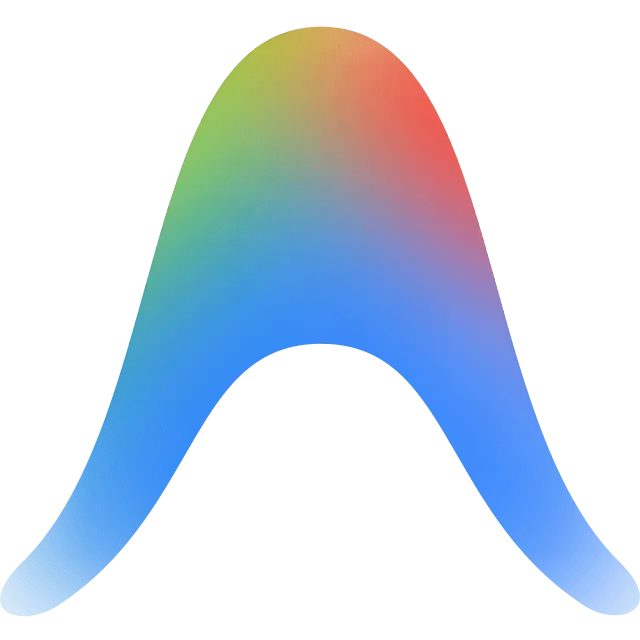
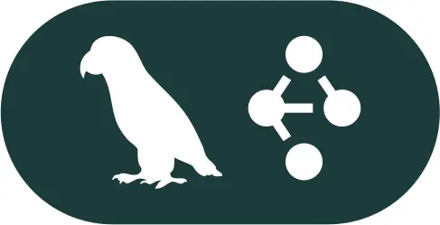

# Liste des applications du diagnostic

| Logo | Outil | Plage de Score | Niveaux Recommandés | Lien | Description |
| :---: | :--- | :---: | :---: | :---: | :--- |
|  | **ChatGPT** | `0.0 - 20.0` | Novice à Expert | [Lien](https://chatgpt.com) | L'assistant conversationnel grand public et professionnel pionnier d'OpenAI, idéal pour rédiger, analyser et concevoir des GPTs personnalisés. |
|  | **Claude** | `0.0 - 20.0` | Novice à Expert | [Lien](https://claude.ai) | Assistant d'Anthropic de haute précision, plébiscité pour ses capacités de raisonnement avancé, de rédaction de code et de traitement de gros volumes. |
|  | **Gemini** | `0.0 - 20.0` | Novice à Expert | [Lien](https://gemini.google.com) | Modèle multimodal de Google directement connecté à son moteur de recherche et à la suite Workspace (Docs, Sheets, Drive). |
|  | **Perplexity** | `0.0 - 18.0` | Novice à Expert | [Lien](https://www.perplexity.ai) | Moteur de recherche conversationnel qui combine recherche web en temps réel et synthèse IA avec citations systématiques des sources. |
|  | **Microsoft Copilot** | `0.0 - 8.0` | Novice à Intermédiaire | [Lien](https://copilot.microsoft.com) | Compagnon IA de Microsoft intégré dans Windows et la suite Office pour assister sur les tâches bureautiques quotidiennes. |
|  | **Google Workspace** | `0.0 - 7.0` | Novice à Intermédiaire | [Lien](https://workspace.google.com) | Intégration native des fonctionnalités d'écriture et d'analyse IA au sein de Google Docs, Sheets, Slides et Gmail. |
|  | **NotebookLM** | `0.5 - 12.0` | Novice à Avancé | [Lien](https://notebooklm.google) | Carnet de notes intelligent de Google permettant d'analyser vos propres documents et de générer des podcasts explicatifs audio. |
|  | **Notion** | `1.0 - 10.0` | Novice à Intermédiaire | [Lien](https://www.notion.so) | Espace de travail collaboratif enrichi par Notion AI pour automatiser la synthèse de notes et structurer des bases de connaissances. |
|  | **Canva** | `2.0 - 12.0` | Novice à Avancé | [Lien](https://www.canva.com) | Plateforme de conception graphique intégrant des outils de génération d'images, de textes et de présentations assistées par IA. |
|  | **Gamma** | `2.0 - 11.0` | Novice à Avancé | [Lien](https://gamma.app) | Outil de création instantanée de présentations interactives, documents et pages web esthétiques à partir d'un simple prompt. |
|  | **Zapier** | `3.0 - 12.0` | Débutant à Avancé | [Lien](https://zapier.com) | Plateforme d'automatisation no-code de premier plan intégrant des briques IA pour connecter des milliers d'applications cloud. |
|  | **Grok** | `4.0 - 13.0` | Débutant à Avancé | [Lien](https://x.ai) | L'IA d'xAI (Elon Musk) intégrée sur le réseau social X, dotée d'une personnalité décontractée et de données actualisées en temps réel. |
|  | **Mistral** | `4.0 - 16.0` | Débutant à Expert | [Lien](https://mistral.ai) | Modèles souverains français de haute performance, open-weights ou propriétaires (Le Chat), respectueux de la souveraineté des données. |
|  | **Make** | `4.0 - 13.0` | Débutant à Avancé | [Lien](https://www.make.com) | Outil d'automatisation no-code visuel permettant de concevoir des flux logiques complexes et d'orchestrer des requêtes IA multiples. |
|  | **Airtable** | `4.0 - 12.0` | Débutant à Avancé | [Lien](https://www.airtable.com) | Base de données relationnelle no-code dotée de fonctionnalités d'IA pour enrichir, catégoriser et synthétiser les données textuelles. |
|  | **DeepSeek** | `5.0 - 16.0` | Débutant à Expert | [Lien](https://chat.deepseek.com) | Modèle open-source de pointe (R1/V3) réputé pour son rapport performance-coût exceptionnel en logique, mathématiques et programmation. |
|  | **Replit** | `5.0 - 12.0` | Débutant à Avancé | [Lien](https://replit.com) | Environnement de développement en ligne collaboratif doté d'une IA d'assistance au code et de déploiements simplifiés. |
|  | **v0** | `5.0 - 13.0` | Débutant à Avancé | [Lien](https://v0.dev) | Générateur d'interfaces web par Vercel produisant du code React/Tailwind prêt à l'emploi à partir de maquettes ou de prompts textuels. |
|  | **Qwen** | `6.0 - 16.0` | Intermédiaire à Expert | [Lien](https://chat.qwenlm.ai) | Famille de modèles multilingues ultra-performants d'Alibaba Cloud excellant en codage, logique et compréhension multimodale. |
|  | **Lovable** | `6.0 - 16.0` | Intermédiaire à Expert | [Lien](https://lovable.dev) | Générateur d'applications web complet (Full-Stack) traduisant des instructions naturelles en applications de production propres. |
|  | **Apify** | `7.0 - 15.0` | Intermédiaire à Avancé | [Lien](https://apify.com) | Plateforme d'extraction de données web (scraping) conçue pour alimenter vos bases de connaissances et vos pipelines RAG. |
|  | **Hugging Face** | `7.0 - 18.0` | Intermédiaire à Expert | [Lien](https://huggingface.co) | La plaque tournante de l'écosystème IA open-source, regroupant des milliers de modèles de deep learning, jeux de données et Spaces. |
|  | **n8n** | `8.0 - 17.0` | Intermédiaire à Expert | [Lien](https://n8n.io) | Outil d'automatisation puissant (fair-code) orienté développeurs avec intégration native de noeuds LangChain pour agents autonomes. |
|  | **Kaggle** | `8.0 - 17.0` | Intermédiaire à Expert | [Lien](https://www.kaggle.com) | Communauté de science des données de Google proposant des concours de machine learning, des jeux de données et des notebooks GPU gratuits. |
|  | **Dify** | `9.0 - 17.0` | Intermédiaire à Expert | [Lien](https://dify.ai) | Plateforme de développement d'applications LLM open-source permettant de configurer RAG, prompts et agents graphiquement. |
|  | **Ollama** | `10.0 - 19.0` | Intermédiaire à Expert | [Lien](https://ollama.com) | Solution en ligne de commande ultra-légère permettant d'exécuter des LLMs open-source localement (Llama, Mistral, Qwen) sur Mac/Win/Linux. |
|  | **LM Studio** | `11.0 - 17.0` | Avancé à Expert | [Lien](https://lmstudio.ai) | Application de bureau élégante pour télécharger et faire tourner des LLMs locaux hors ligne avec exposition d'API compatible OpenAI. |
|  | **Langflow** | `11.0 - 17.0` | Avancé à Expert | [Lien](https://www.langflow.org) | Interface visuelle glisser-déposer pour concevoir et prototyper des pipelines IA et des agents complexes basés sur LangChain. |
|  | **Flowise** | `11.0 - 17.0` | Avancé à Expert | [Lien](https://flowiseai.com) | Solution open-source d'orchestration visuelle de modèles et de chaînes d'agents IA, déployable facilement via Docker. |
|  | **GitHub Copilot** | `11.0 - 20.0` | Avancé à Expert | [Lien](https://github.com/features/copilot) | L'assistant officiel de programmation de GitHub s'intégrant dans votre IDE pour proposer des complétions et explications de code. |
|  | **Cursor** | `12.0 - 20.0` | Avancé à Expert | [Lien](https://www.cursor.com) | Éditeur de code révolutionnaire (fork de VS Code) conçu pour l'édition de code multi-fichiers guidée par l'intelligence artificielle. |
|  | **Windmill** | `13.0 - 18.0` | Avancé à Expert | [Lien](https://www.windmill.dev) | Alternative ultra-rapide et sécurisée pour transformer vos scripts (Python, TS, Bash) en workflows d'arrière-plan et interfaces d'outils. |
|  | **Claude Code** | `14.0 - 20.0` | Avancé à Expert | [Lien](https://claude.com/product/claude-code) | Agent de développement en ligne de commande par Anthropic capable d'éditer, de tester et de git-commit votre codebase directement. |
|  | **LangChain** | `14.0 - 20.0` | Avancé à Expert | [Lien](https://www.langchain.com) | Framework de développement incontournable pour construire des applications complexes pilotées par des modèles de langage. |
|  | **Antigravity** | `15.0 - 20.0` | Avancé à Expert | [Lien](https://antigravity.google/) | L'agent de développement autonome premium développé par Google DeepMind pour le pair-programming et le codage interactif. |
|  | **Manus** | `15.0 - 20.0` | Avancé à Expert | [Lien](https://manus.im) | Agent IA généraliste capable d'exécuter des tâches informatiques complexes et d'automatiser des scénarios web de bout en bout. |
|  | **MCP** | `15.0 - 20.0` | Avancé à Expert | [Lien](https://modelcontextprotocol.io) | Model Context Protocol — standard d'Anthropic pour connecter de façon sécurisée les LLMs à des serveurs d'outils et de données locaux. |
|  | **OpenClaw** | `15.5 - 19.0` | Expert | [Lien](https://openclaw.ai/) | Framework agentique open-source et modulaire permettant d'exécuter des boucles d'actions et de raisonnement autonomes. |
|  | **LangGraph** | `16.0 - 20.0` | Expert | [Lien](https://www.langchain.com/langgraph) | Outil de LangChain pour orchestrer des architectures multi-agents hautement contrôlables sous forme de graphes d'états cycliques. |
|  | **MLflow** | `17.0 - 20.0` | Expert | [Lien](https://mlflow.org) | Plateforme de gestion du cycle de vie des modèles ML (suivi d'expériences, registre de modèles et gestion des déploiements). |
